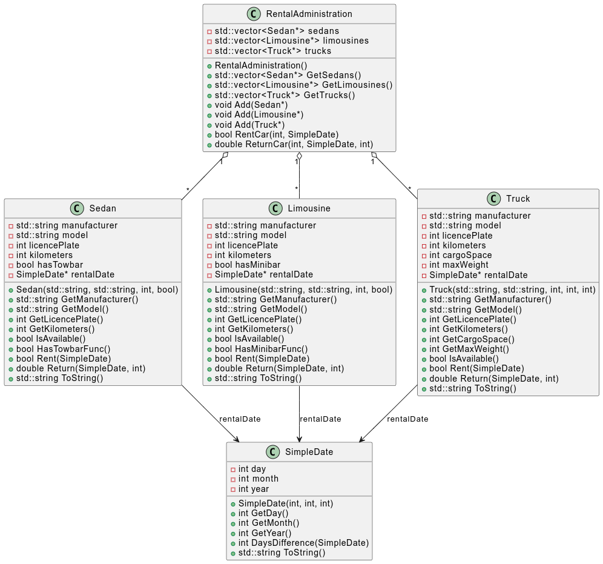
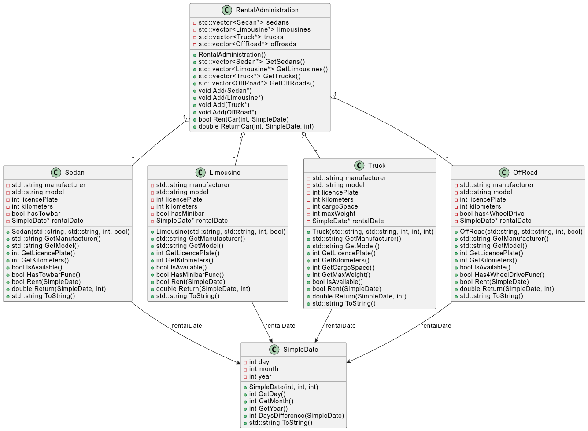
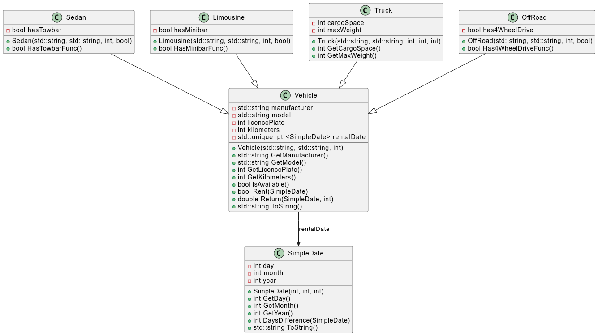
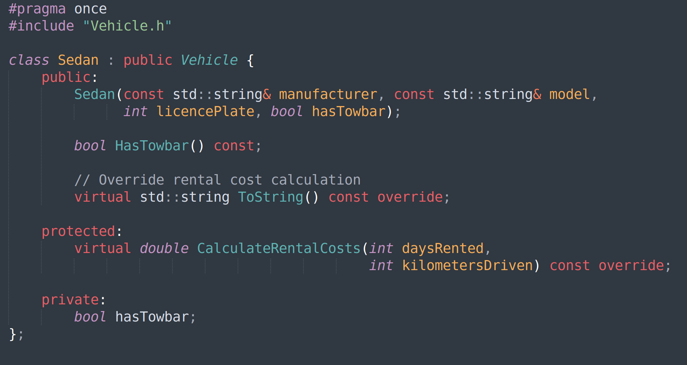
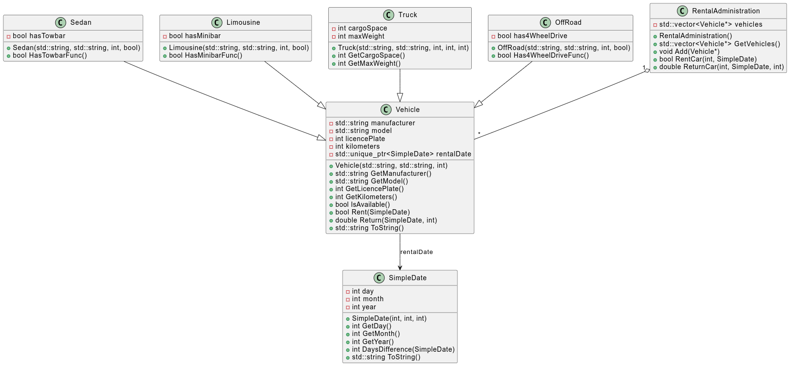

\clearpage

# Case: How a Vehicle Rental Application went bad

A customer wants an administration program for renting limousines, trucks and sedans.
A class diagram has been created in which the customer's wishes have been translated into classes.
The class diagram has then been translated into a program. This has then been put into use by the customer.

The class diagram has been translated into code that is available to you.
The application contains a simple terminal menu for manually testing the code.

Take a look through the code. Can you find the classes from the class diagram?

## Overview

For this workshop you will make 3 changes to the code as requested by the customer.
We then will review the changes and review our way of working.

\clearpage

# Customer Request 1: License plate

The customer has a new wish to change program:

**The license plates of the vehicles must be able to contain all characters. Not just numbers as in the current situation.**

##  Code updates (15 minutes)

Indicate in the class diagram what needs to be changed.
Make the change in the code of the classes and ensure a working program that satisfies the customer (the menu code in main.cpp has the lowest priority).

## Review

What code did you change and how what this experience?

## Review checks

Did you not that:

- All vehicles (the Limousine, Sedan and Truck classes) contain the class member 'licencePlate'.
- You must change this to the type 'string' for each vehicle.
- The type of the parameter 'licencePlate' in the constructor must be adjusted for each vehicle.

Does the above feel like double work?!

Furthermore, the license plate of the vehicles is used in several places in the code. The code also had to be changed to take the new data type into account.

\clearpage

# Customer Request 2: Build Year

The customer is unpredictable and wants another change to the program:

**The year of construction of vehicles that are added to the administration must be recorded. This must also be visible in the lists of vehicles.**

## Code updates (15 minutes)

Indicate in the class diagram what needs to be changed.

Make the change in the code of the classes and ensure a working program that the customer is satisfied with (the menu code has the lowest priority).

Hint: Adjust the ToString() methods too!

## Code review

What code did you change and how what this experience?

## Spoiler: Code review results

+ The class member 'BuildYear' (or something similar) must be added to each vehicle (the Limousine, Sedan and Truck classes).
+ The constructor of each vehicle must be adjusted. The parameter ‘buildYear’ must be added so that you can set the year of construction.
+ The ToString() method of each vehicle must be adjusted so that the year of construction is also included in the returned string and is visible in the GUI.

Does the above feel like double work?!

Furthermore, the code of the menu had to be adjusted so that the user can enter the year of construction.

\clearpage

# Customer Request 3: OffRoad vehicles

The customer has tapped into a new market and has a new wish:

**Vehicles of the ‘OffRoad’ type must also be rented out. The following must be recorded for an OffRoad vehicle:**

- **The manufacturer**
- **The model**
- **The year of construction**
- **The license plate**
- **The number of kilometers driven**
- **Does it have 4-wheel drive yes/no**
- **The rental date and is it available for rental**
- **The rental costs are 170 euros per day due to the increased risk of off-road driving and 35 cents must be charged per kilometer driven.**

## Code updates (15 minutes)

Indicate in the class diagram what needs to be changed.

Make the change in the code of the classes and ensure a working program that satisfies the customer (the menu has the lowest priority).

## Code review

In the figure below there is an updated version of the class diagram including the OffRoad class:

## Spoiler: Code review results

- The new class ‘OffRoad’ is almost a complete copy of Sedan, Limousine and Truck.
- For each type of vehicle an ‘Add’ method must be present in the administration class. So for each new type of vehicle a new ‘Add’ method must be added.
- The methods for renting and taking back vehicles must be adjusted. After all, each type of vehicle is kept in a separate list (reason: a list can only contain one type of objects).
- The methods for renting and taking back vehicles must search for the desired license plate in each of these lists.

Does the above feel like double work?!

Furthermore, the code of the menu had to be adjusted so that the user can enter the new type of vehicle.

\clearpage

# Thinking about alternative options

Take 5 minutes to think about the following question:

- What did you see/experience while making the 3 requested changes?
- How would you improve the quality of the code?

## Observations after 3 changes

Did you observe that:

+ The vehicles contain duplicated code for common attributes and operations.
+ When changing the duplicated code in one vehicle class, the same adjustment must also be made in all other vehicle classes.
+ Adding a new type of vehicle to the system will result in even more code duplication.

Does the duplication cause:

+ more or less work when maintaining the code?
+ more or fewer errors when maintaining the code?

# Possible solution direction

Image that you can put common attributes and operations of the vehicles in a separate common class.

And that you can use this common class from any other vehicle type class.

Let's take a look at this using the UML class diagram that introduces a new class called `Vehicle`:

Please note that:

+ In the new class diagram you can see that much less code will be duplicated.
+ A lot of duplicated code has been moved to the common class vehicle.
+ But... how can you use the common class code from any specific vehicle?
+ And what do we do with code in class methods that is nearly identical but still needs some small tweaks?

\clearpage

# Solution: Inheritance

- Limousine and Sedan are different classes.
- They can receive identical messages (i.e. GetManufacturer(), Return(), Clear(), etc.)
- To some of these messages they respond in a different way (i.e.: different answer)

By means of inheritance you can use base classes and put specialized behavior in derived classes.
Please study how inheritance works in C++ by looking at the provided examples.

As a spoiler alert the header file for the Sedan class could look like this:

## Code updates (15 minutes)

When using inheritance the overall class diagram looks like given in the figure below:

Consider performing the following updates to the class:

- Create a Vehicle class by putting all shared behavior into this class.
- Refactor at least one of the other Vehicle classes by letting it inherit from the Vehicle class.
- Refactor the RentalAdministration class by making use of the Vehicle class.
    - Do you notice in the class diagram that the RentalAdministration class only has a direct relation with the Vehicle class?
    - Does the RentalAdministration header file therefore still need to include header files for all Vehicles classes?
    - What do you think of the refactored implementation?

Tip: from the derived methods it is still possible to interact with the methods of the base class. For instance also see [Calling inherited functions and overriding behavior](https://www.learncpp.com/cpp-tutorial/calling-inherited-functions-and-overriding-behavior/).

\clearpage

# Further recommendation: Polymorphism

A topic related to inheritance is polymorphism. Polymorphism in an object oriented system is the ability of different objects to respond to the same message with different answer. Please study in what sense concepts Inheritance and Polymorphism related to each other and how they differ?